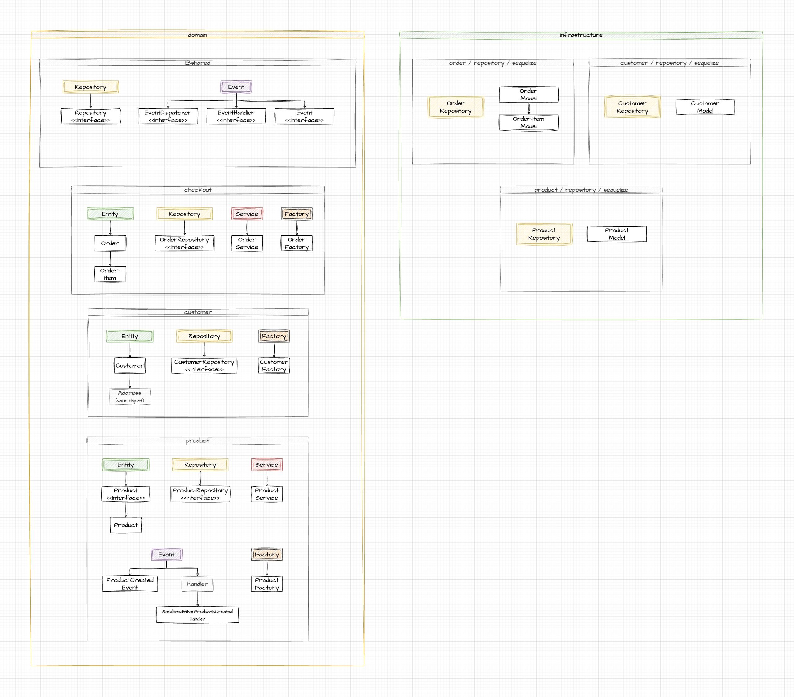

# DDD Patterns

## Introduction

Welcome to the **"DDD Patterns"** project. This project serves as a study case, applying the principles of Domain-Driven Design (DDD) to a simple solution encompassing three core concepts: Customers, Products, and Orders.

My purpose here is to dissect the intricacies of DDD by providing a practical example. We dive into the implementation of domains and infrastructural aspects, offering an environment where both the theory and practice of DDD come to life. This way, you can gain insights into how these elements interplay in a real-world application.

By exploring **"DDD Patterns"**, you will have the chance to understand the powerful design benefits that DDD brings to software development. We hope that this will be a valuable resource for developers at all levels of familiarity with DDD, from novices to veterans.

Please, feel free to navigate through the project, inspect the code, and let us know if you have any questions, suggestions or feedback. All are welcome!

## Stack

In the **"DDD Patterns"** project, we have utilized a combination of technologies to achieve our goals. These choices were made to ensure that our project is robust, scalable, and maintainable. Here's a brief overview of our technology stack:

### TypeScript

For the project's main language, we chose TypeScript. TypeScript is a strongly typed superset of JavaScript that compiles to plain JavaScript. It brings a new level of reliability and development experience by introducing static types, interfaces, and classes to JavaScript, which aligns well with our aim to implement a Domain-Driven Design (DDD).

Using TypeScript has allowed us to enforce a certain level of correctness at compile-time and make our codebase more understandable and easier to refactor, key benefits in a DDD environment where domain complexity can grow quite significantly.

### Sequelize

As part of our backend infrastructure, we've incorporated the Sequelize library. Sequelize is a promise-based Node.js ORM for Postgres, MySQL, MariaDB, SQLite, and Microsoft SQL Server. It features solid transaction support, relations, eager and lazy loading, read replication, and more.

However, for the purposes of this study case, we are utilizing Sequelize with an in-memory database. This approach allows us to easily simulate database operations without the need for a separate database setup, making the project more accessible to developers who want to quickly run and study the project without having to deal with database setup.

### Jest

Testing is a critical aspect of any application, helping to ensure the correctness of our codebase and improving its maintainability. For this reason, we've integrated Jest as our testing framework of choice in the **"DDD Patterns"** project.

Jest is a delightful JavaScript Testing Framework with a focus on simplicity. It provides a comprehensive set of features, such as a simple API for structuring your tests, snapshots for capturing and comparing UI changes, an easy setup and teardown mechanism for tests, and seamless parallelization of test runs.

Using Jest, we're able to write unit tests for our individual components and integration tests to verify the interaction between them. It also allows us to practice Test-Driven Development (TDD), a cornerstone practice in the DDD approach.

## Project Structure

## Conclusion

Thank you for your interest in the **"DDD Patterns"** project. We appreciate your time and attention, and warmly invite your suggestions or constructive criticism. Feel free to raise issues, submit pull requests, or just share your thoughts. Your contribution helps us improve and learn. Once again, thank you, and happy exploring!